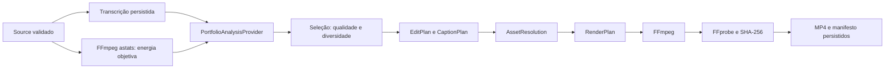

# ClipPortfolio e editor local

O web agora inicia `/uploads/:id/portfolio/process` após upload/YouTube. O fluxo
original `/process` permanece disponível, com a análise anterior e seus lotes.
Portfólio e análise original usam arquivos/cache distintos. Esta extensão usa
os serviços existentes de upload, ASR, quota, integridade e FFmpeg; não cria fila,
banco, novo pacote, serviço pago ou dependência.

## Fluxo e responsabilidades



`portfolio/` analisa e seleciona. `editing/` contém planejamento, captions,
pacing, framing, música, B-roll, resolução de assets e execução de filtros.
`processing/` orquestra as etapas. `clip-rendering/` mantém subprocesso, storage,
validação/publicação e entrega HTTP. O renderer recebe todos os planos prontos;
não escolhe preset, pausas, música ou zoom. Até o fluxo original prepara CLEAN
antes de entrar no renderer. Não há pastas vazias para funções futuras.

Etapas novas: `planning-edits` e `resolving-assets`. Um gate de admissão impede
dois pipelines simultâneos, inclusive entre fluxo original e portfólio. O gate
de CPU existente continua protegendo ASR, medição de áudio e render. Não há fila:
concorrência indisponível responde BUSY/429. Cancelamento/shutdown aguardam cleanup.

## Descoberta, score, famílias e seleção

Versão: `portfolio-local-1.0.2`. Reutiliza unidades de fala e bordas da análise
validada: pontuação conclusiva/pausas, sem divisão periódica ou reorganização de
fala. Amostra até 160 aberturas distribuídas pelo vídeo; considera dois finais
próximos do alvo por perfil, até 1.280 candidatos. Esse teto limita trabalho e
persistência; não limita a três outputs.

| Perfil | Orientação | Alvo | Objetivo |
| --- | --- | ---: | --- |
| MICRO | 8–20 s | 14 s | Hook/punchline |
| SHORT | 20–45 s | 34 s | Explicação rápida |
| STANDARD | 45–75 s | 60 s | Desenvolvimento |
| EXTENDED | 75–180 s | 105 s | História/raciocínio |

Pode aceitar uma frase completa até 15% fora da orientação; nunca ultrapassa
180 s. Fala sem borda adequada não é cortada para cumprir duração. Os pesos do
score original são preservados; apenas penalidades de duração recebem a faixa
do perfil. PotentialScore continua sendo heurística local explicável, sem
promessa de viralização. HookScore separado observa palavras dos primeiros
3 s: clareza, pergunta, curiosidade, conflito/surpresa, especificidade e promessa.
StoryArc procura setup, desenvolvimento e payoff em ordem, com evidência lexical.

Rejeita fechamento incompleto, pouca fala útil, abertura dependente, score <40,
transições como “tá bom/então vamos lá” na abertura e predomínio de promoção/CTA.
O audit guarda perfil, bordas, score, decisão, motivos e referência/sobreposição
de duplicatas. Sobreposição é interseção dividida pela duração do menor trecho.
Dedup >=82% somente dentro do mesmo perfil. FamilyId deriva da abertura, mantendo
versões com objetivos/durações diferentes. Não se infere identidade semântica
entre aberturas diferentes; isso é uma limitação da família local.

| Quantidade | Piso | Orçamento adaptativo |
| --- | ---: | --- |
| Auto / Normal | 46 | ceil(duração do source / 20) |
| Poucos | 55 | ceil(duração / 90) |
| Muitos | 43 | ceil(duração / 10) |
| Máximo aproveitamento | 40 | Todos os candidatos aprovados e deduplicados |

Orçamentos são máximos, não quotas. A seleção pode retornar menos ou nenhum.
Nos modos adaptativos, sobreposição >50% dentro do mesmo perfil impede repetição.
Utility = score + hook×0,06 + perfil ainda não coberto×12 + emoção nova×3 + estilo
AUTO novo×2 − maior sobreposição×6 − maior similaridade de tokens×8. Presets são
inferidos pelo mesmo `chooseStyle` usado no planejamento. Similaridade é Jaccard
de tokens, sem embeddings. Estados incrementais evitam recalcular comparações
dentro de ordenações; Máximo retorna o pool aprovado, sem esse custo quadrático.

ClipPortfolio contém buckets, highlights, bestOverall, famílias e rankings
strongestHook, mostEmotional, mostEducational, funniest, mostShareable,
bestMicro/bestLongForm. Categorias sem evidência permanecem vazias.

## Emoção e áudio

SemanticEmotion: vocabulário português com trechos de evidência e confiança
lexical limitada a 0,45. AudioEnergy: FFmpeg astats a cada 500 ms, RMS/peak em
dBFS, variação percentil 90–10, proporção quieta e palavras/s da transcrição.
Média de dB das janelas não é LUFS integrado. Áudio alto não é interpretado como
emoção. VisualEnergy fica explicitamente indisponível. Não há pitch/prosódia
avançada nem nova biblioteca. Os sinais objetivos não alteram o score textual;
guiam pacing, além de permitir inspeção dos candidatos.

Eventos guardam timestamps de números, marcadores e palavras fortes/emocionais;
perguntas de confirmação como “tá?” não geram zoom por si. São proxies lexicais,
não detecção científica de punchline/clímax. Emoção ajuda diversidade e AUTO;
vulnerabilidade/tensão/inspiração podem escolher EMOTIONAL, micro escolhe DYNAMIC,
história extended com arco escolhe STORY, números/listas podem escolher EDUCATIONAL.

## EditPlan e efeitos reais

EditPlan `social-edit-1.0.1`: estilo, sourceRange, RenderProfile, timeline, pacing,
framing, CaptionPlan, zoom/emphasis/B-roll, MusicPlan, SoundEffectPlan, silenceCuts
e transitions. Source times são absolutos; efeitos e captions usam tempo relativo
à timeline final. Vídeo/áudio são aparados juntos e concatenados na mesma ordem.
Palavras são remapeadas após cada corte, evitando perda de sincronização.

| Preset | Implementado agora | Extensões |
| --- | --- | --- |
| CLEAN | Caption discreta, framing seguro, preserva pausas | — |
| DYNAMIC | Palavra ativa, zoom 8%, pacing conservador | Efeitos licenciados |
| STORY | Caption discreta, zoom 4,5%, pausas preservadas, pede música | B-roll contextual |
| EMOTIONAL | Palavra ativa, zoom 4,5%, preserva pausas, pede música | Inferência mais rica |
| EDUCATIONAL | Palavra ativa, conceitos/números maiores, zoom 4,5% | Overlays |
| PODCAST | Captions, zoom 4,5%, framing seguro, pacing conservador | Active speaker/diarização |
| AUTO | Escolhe os presets acima | — |

CaptionPlan `caption-plan-1.0.1`: grupos de até cinco palavras/~30 caracteres,
timestamps reais, highlight por palavra via ASS/libass e keywords quatro pixels
maiores. Fonte 60 px em 1080×1920. Safe area configurável: esquerda 12%, direita
18%, topo 15%, base 24%, baseline 73%. Centro horizontal calculado entre as margens
(47% no padrão). As margens são conservadoras, não uma garantia para toda variação
de UI de cada rede. Sem reposicionamento aleatório, flashes ou fonte excessiva.

Zoom usa escala/crop animados de verdade: 8% em DYNAMIC e 4,5% nos demais estilos,
com entrada/saída de 180 ms, razão explícita, intervalo mínimo de 8/15 s e orçamento
de 4/2 efeitos por minuto. CLEAN não gera zoom. Framing atual conserva o quadro
com padding ou crop central quando >=68% da área é retida. Não identifica rostos.

Pausas só são aparadas nos estilos não calmos quando todas as janelas que
intersectam o trecho cobrem seu intervalo e confirmam RMS <=−38 dBFS. Preserva
220 ms nas bordas, pausas junto de pergunta/emoção/conclusão, shots mínimos de
2 s e no máximo 20% da duração. Sem evidência, preserva. Transição atual é corte;
não há speed-up da fala, rearranjo de narrativa ou remoção indiscriminada.

## Música, B-roll e degradação

MusicPlan separa pedido/mood da resolução. LocalMusicProvider opcional recebe
`ProcessingOptions.musicDirectory`. Sem configuração/asset, retorna null.
Catálogo `catalog.json` (schemaVersion 1, music[]) só aceita approved=true,
mood correspondente, ID seguro, extensão wav/mp3/m4a/ogg, license não vazia e
checksum SHA-256 correto. Arquivo regular <=32 MiB, sem symlink/traversal. Aprovação
no catálogo é declaração do operador; não verifica juridicamente a licença.

Exemplo de entrada, que deve ser preenchida somente com um asset autorizado:

```json
{"schemaVersion":1,"music":[{"id":"trilha-aprovada","extension":".wav","mood":"emotional","approved":true,"license":"Identificação da licença autorizada","checksum":"SHA256_REAL_DE_64_CARACTERES"}]}
```

Asset aprovado é copiado para o trabalho privado e seu hash é verificado de novo.
Volume musical 0,06, fades 0,5/0,8 s, looping até a duração. Sidechaincompress
reduz música conforme a voz (threshold 0,03, ratio 8, attack 15 ms, release 300 ms);
amix mantém ganho original da voz. Música comercial em volume baixo não é aceita.
Ausência/corrupção do asset opcional vira warning, sem bloquear o clip.

BRollProvider tem fontes futuras original-video, user, licensed-stock, external,
generated-image/generated-video. SourceBRollProvider só resolve cenas previamente
descritas/aprovadas e fora do sourceRange do clip, com correspondência contextual
de tokens. O compositor de B-roll ainda não existe; mesmo um asset encontrado
é explicitamente omitido. Cues atuais são conservadores: número junto de objeto
concreto citado. SoundEffectPlan e shots multi-speaker são contratos; não há
execução de efeitos sonoros, diarização, split-screen ou detector visual.

Busca no projeto atual/backup de package.json não encontrou face detection,
active speaker, diarização ou reframe reutilizável. O diretório antigo `app/`
não está disponível neste workspace. Não foi instalado pacote de visão.
No sample, FFmpeg fps=2/scale=160:90/select scene>0,3 não encontrou mudança de cena.
Frames revisados mostram o mesmo monólogo/enquadramento; não há cutaways
contextuais aprovados. Esse resultado não é uma classificação semântica visual.

## Rotas e interface

| Rota | Uso |
| --- | --- |
| POST/GET `/uploads/:id/portfolio` | Analisa transcrição concluída/consulta report |
| GET `/uploads/:id/portfolio/status` | Status da análise |
| GET `/uploads/:id/portfolio/candidates/:candidateId` | Candidato |
| POST `/uploads/:id/portfolio/process` | Fluxo completo; body opcional quantity/style/candidateIds |
| GET `/uploads/:id/portfolio/process/status` | Etapa/progresso/erro real |
| DELETE `/uploads/:id/portfolio/process` | Cancelamento e cleanup |
| GET `/uploads/:id/portfolio/clips` | Lote concluído com report/EditPlans/metadados |
| GET `/uploads/:id/clips/:batchId/:candidateId/file` | MP4/range/download compartilhado |

Quantity: auto/few/normal/many/maximum. Style: AUTO/CLEAN/DYNAMIC/STORY/EMOTIONAL/
EDUCATIONAL/PODCAST. candidateIds seleciona explicitamente candidatos do report
atual; recusa vazio, duplicação, desconhecidos e mais de 1.280. Nenhum plano,
caminho de asset ou URL externa é aceito na requisição. Sem IDs, seleção automática.

Web preserva Glassmorphism e usa o proxy existente para API 127.0.0.1:3001.
Adiciona filtros Todos/Micro/Short/Standard/Extended e ordenação potencial, hook,
emoção, educacional e duração. Cards mostram tipo, estilo, scores e sinais textuais.
Erro do backend, API offline e timeout de consulta continuam separados. Quantidade
e preset já são opções da API; ainda não há controles desses parâmetros no web.

## Storage e validação

`portfolio.json` e parcial contam na quota de uploads e não substituem analysis.json
ou transcript.json. Hash/versão vinculam análise à transcrição e ao source.
Manifesto guarda análise e seus hashes, EditPlans, versões, preferências,
metadados, warnings, duração, tamanho e SHA-256 de cada MP4. Cache considera fluxo,
versões, source, preferências e seleção; consulta acompanha lote reutilizado,
mesmo quando existe um lote mais recente de outro preset. Leitura histórica é
sequencial, sem carregar todos os manifestos na RAM. Planos 1.0.0 continuam legíveis.

Render `editplan-ffmpeg-1.0.1`: libopenh264/AAC, fps 30, vertical-social 1080×1920.
Square/landscape são perfis preparados no mesmo executor, ainda sem exposição no
web/validação real desses formatos. FFprobe verifica áudio/vídeo, codecs, dimensões
e duração <=0,3 s de diferença. Cada output tem orçamento calculado pela duração,
teto 128 MiB, -fs e quota global de outputs padrão 4 GiB. Report/manifesto <=16 MiB.
Cada clip usa fonte verificada própria e render com prazo de 5 min; o lote tem
60 min, incluindo planejamento. Ambos são configuráveis em [vídeos longos](long-videos.md).
Publicação do lote é atômica; falha limpa trabalho parcial e mantém lotes anteriores.

FFmpeg instalado suporta `-/filter_complex arquivo.ffgraph`; sua versão não aceita
`-filter_complex_script`. ASS, grafo e assets têm nomes controlados no trabalho UUID
e são removidos antes da publicação. O scanner reconhece portfolio.json; yt-dlp,
FFmpeg de ingestão/remux, seleção progressiva/fallback, ASR e retenção não foram
reescritos. Nenhum pacote/lockfile, secret, banco ou backup foi alterado nesta fase.

## Verificação e referências

```powershell
pnpm.cmd typecheck
pnpm.cmd build
node --test --test-concurrency=1 apps/api/tests/*.test.mjs apps/worker/tests/*.test.mjs
node --experimental-strip-types --test apps/web/tests/*.test.ts
node scripts/portfolio/smoke-test.mjs
```

O smoke padrão usa o sample português já ingerido/transcrito, em storage isolado,
e modo many. Argumentos opcionais: diretório de uploads, uploadId, quantity.
Não dispara ASR novamente. Resultados completos em
[validação do portfólio](portfolio-validation-2026-10-08.md).

Inspiração funcional consultada em fontes oficiais: [editor/reframe OpusClip](https://www.opus.pro/ai-video-editor),
[reframe OpusClip](https://www.opus.pro/ai-reframe), [caption/reframe Klap](https://docs.klap.app/usecases/caption-reframe-video),
[API Klap](https://klap.app/api), [speaker Vizard](https://vizard.ai/blog/vizards-speaker-identification-just-got-smarter),
[edição Captions](https://captions.ai/features/edit-with-ai),
[AI Edit Captions](https://help.captions.ai/docs/project/ai-edit).
Essas referências motivam capacidades separadas; não fornecem algoritmo local,
score, interface ou garantias. FFmpeg foi investigado pela ajuda do binário
instalado e pela [documentação oficial](https://ffmpeg.org/ffmpeg.html).
